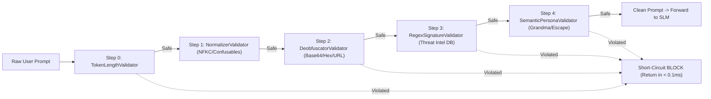

# ADR 0004: Chain-of-Responsibility Guardrail Pipeline Architecture

**Status:** Accepted  
**Date:** 2026-09-21  
**Deciders:** Lead Security Architect, Staff Backend Engineer  

---

## Context and Problem Statement

As security requirements expand to include new validators (e.g. specialized PII detectors, embedding-based semantic checkers, custom enterprise compliance validators, audio/image prompt filters), monolithic `InputGuardrailEngine` and `OutputGuardrailEngine` classes violate the **Open-Closed Principle (OCP)** and **Single Responsibility Principle (SRP)**.

A modular pipeline is required where:
1. Individual validators (e.g. Invisible Character Stripper, Unicode Normalizer, De-obfuscator, Compiled Regex Matcher, Semantic Persona Validator, PII Masker) are decoupled into discrete, self-contained units.
2. Validators can be easily added, removed, re-ordered, or dynamically enabled/disabled via configuration.
3. Fast short-circuiting is supported (e.g. if a hard prompt injection is detected in Step 1, downstream validators are skipped to conserve CPU cycles).

---

## Decision Drivers

- **Extensibility**: Third-party developers and enterprise customers can add domain-specific validators with minimal code changes.
- **Short-Circuit Evaluation**: Instant termination on critical violations to minimize p99 latency.
- **Observability**: Per-validator execution timing and telemetry.
- **Backward Compatibility**: Seamless drop-in compatibility with existing `InputGuardrailEngine.inspect()` and `OutputGuardrailEngine.sanitize()` methods.

---

## Decision Outcome

Adopt the **Chain-of-Responsibility (Pipeline)** design pattern:

### Core Interfaces (`backend/guardrails/base.py`)
- `GuardrailContext`: Carries raw text, normalized text, session attributes, and accumulated metadata.
- `ValidationResult`: Encapsulates `is_safe`, `violation_type`, `matched_rule`, `details`, `modified_text`, `action` (`ALLOW`, `BLOCK`, `MASK`, `WARN`), and `latency_ms`.
- `BaseValidator`: Abstract base class implementing `validate(context: GuardrailContext) -> ValidationResult`.
- `GuardrailPipeline`: Coordinates sequential validator execution with short-circuiting and aggregate metric recording.

---

## Consequences

### Positive
- **High Modularity**: Individual validators can be unit-tested in complete isolation.
- **Pluggability**: New enterprise compliance rules can be inserted as standalone classes without modifying existing code.
- **Granular Telemetry**: Clear visibility into exact latency contributions of each pipeline stage.

### Negative / Trade-offs
- Slight object instantiation overhead (~microsecond scale), negligible compared to network I/O.
